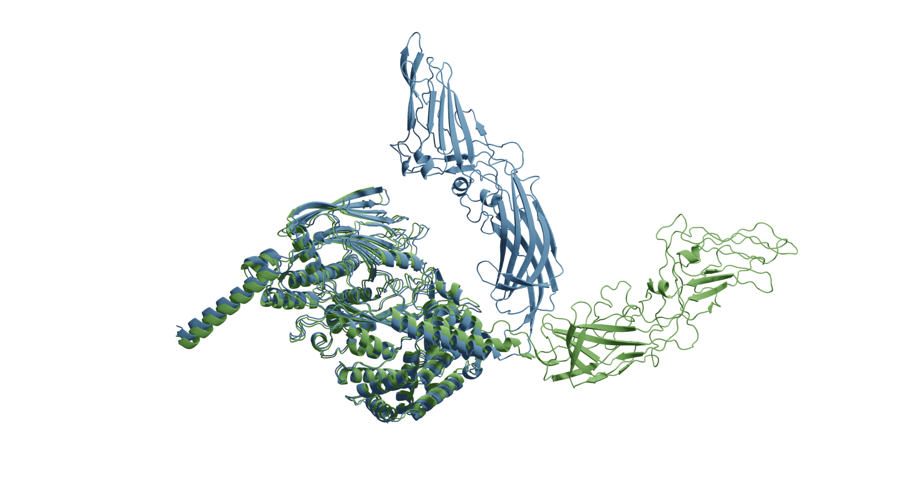

Our research tries to answer questions about the evolution of proteins and how this information can be used to create a new range of AI tools.
The tools we have developed make it possible to predict the structure of protein interactions, and to design new molecules that bind to proteins.
 
 
We aim to create a universal molecular framework, where any molecule can be predicted.
We are deploying the technology we develop and **test it in the lab** to create new molecular functions to improve diagnostics and treat diseases such as **cancer**.
 
 

# Agonist Design Beyond Natural Amino Acids
By transfer learning from RareFold on high-quality structurtes from GPCRdb, we can learn how to incorporate noncanonical amino acids (NCAAs) seen in RareFold to the structure prediction of GPCRs without ever having seen NCAA-based GPCR modulators. This creates possibilities for new chemistry, immune evasion and degradation resistance.

Li Q, Helleday T and **Bryant P**. RareFoldGPCR: Agonist Design Beyond Natural Amino Acids. bioRxiv 2025.10.01.679733; doi:10.1101/2025.10.01.679733
[Paper](https://www.biorxiv.org/content/10.1101/2025.10.01.679733v1)
[Code](https://github.com/patrickbryant1/RareFoldGPCR)

# Noncanonical Amino Acids

RareFold is a breakthrough deep learning model that accurately predicts protein structures with noncanonical amino acids and enables the design of high-affinity peptide binders (both linear and cyclic) through its EvoBindRare framework. Expanding beyond the 20 standard amino acids, RareFold opens new possibilities for therapeutic design with enhanced stability, specificity, and immune evasion.

  
&nbsp; &nbsp; &nbsp; &nbsp;
  

Li Q, Daumiller D, Zuo F, Marcotte H, Pan-Hammarstrom Q and **Bryant P.** RareFold: Structure prediction and design of proteins with noncanonical amino acids. bioRxiv. **2025**. p. 2025.05.19.654846. doi:10.1101/2025.05.19.654846
[Paper](https://www.biorxiv.org/content/10.1101/2025.05.19.654846v2)
[Code](https://github.com/patrickbryant1/RareFold)

# Agonist design

Li Q, Wiita E, Helleday T, **Bryant P.**
Blind De Novo Design of Dual Cyclic Peptide Agonists Targeting GCGR and GLP1R.
bioRxiv. **2025**. p. 2025.06.06.658268.
doi: https://doi.org/10.1101/2025.06.06.658268
[Paper](https://www.biorxiv.org/content/10.1101/2025.06.06.658268v1)
[Code](https://github.com/patrickbryant1/EvoBind)

  

# Inhibitor design

Daumiller D*, Giammarino F*, Li Q, Sonnerborg A, Cena-Diez R, **Bryant P.** Single-Shot Design of a Cyclic Peptide Inhibitor of HIV-1 Membrane Fusion with EvoBind. bioRxiv. **2025**. p. 2025.04.30.651413. doi:10.1101/2025.04.30.651413
[Paper](https://www.biorxiv.org/content/10.1101/2025.04.30.651413v1)
[Code](https://gitlab.com/patrickbryant1/gp41)

  

# Binder design

Li, Q., Vlachos, E.N. & **Bryant, P.** Design of linear and cyclic peptide binders from protein sequence information. Commun Chem 8, 211 (**2025**). https://doi.org/10.1038/s42004-025-01601-3
[Paper](https://www.nature.com/articles/s42004-025-01601-3)
[Code](https://github.com/patrickbryant1/EvoBind)

**Bryant P.**, Elofsson A. Peptide binder design with inverse folding and protein structure prediction. Communications Chemistry. (**2023**); 6: 229.
[Paper](https://www.nature.com/articles/s42004-023-01029-7)

  
&nbsp; &nbsp; &nbsp; &nbsp;
  

 

# Structure prediction of protein-ligand complexes

**Bryant, P.**, Kelkar, A., Guljas, A. Clementi, C. and Noé F. Structure prediction of protein-ligand complexes from sequence information with Umol. Nat Commun 15, 4536 (**2024**). https://doi.org/10.1038/s41467-024-48837-6
[Paper](https://www.nature.com/articles/s41467-024-48837-6)
[Code](https://github.com/patrickbryant1/Umol)

 

# Structure prediction of alternative protein conformations

**Bryant P**, Noé F. Structure prediction of alternative protein conformations. Nat Commun 15, 7328 (**2024**).
[Paper](https://www.nature.com/articles/s41467-024-51507-2)
[Code](https://github.com/patrickbryant1/Cfold/tree/master)

 

# Structure prediction of protein complexes

Saluri M, Landreh M, **Bryant P** (**2025**) AI-first structural identification of pathogenic protein target interfaces. PLoS Comput Biol 21(6): e1013168. https://doi.org/10.1371/journal.pcbi.1013168
[Paper](https://journals.plos.org/ploscompbiol/article?id=10.1371/journal.pcbi.1013168)
[Code](https://gitlab.com/patrickbryant1/hpopt)

**Bryant P**, Noé F. Improved protein complex prediction with AlphaFold-multimer by denoising the MSA profile. PLoS Comput Biol. (**2024**);20: e1012253.
[Paper](https://journals.plos.org/ploscompbiol/article?id=10.1371/journal.pcbi.1012253)
[Code](https://github.com/patrickbryant1/AFProfile)

**Bryant, P.**, Pozzati, G., Zhu, W. et al. Predicting the structure of large protein complexes using AlphaFold and Monte Carlo tree search. Nat Commun 13, 6028 (**2022**).
[Paper](https://www.nature.com/articles/s41467-022-33729-4)
[Code](https://github.com/patrickbryant1/MoLPC)

**Bryant P.**, Pozzati G., Elofsson A. Improved prediction of protein-protein interactions using AlphaFold2. Nat Commun 13: 1–11 (**2022**).
[Paper](https://www.nature.com/articles/s41467-022-28865-w)
[Code](https://gitlab.com/ElofssonLab/FoldDock)
[Better code](https://github.com/patrickbryant1/SpeedPPI)

Burke, D.F.^, **Bryant, P.^**, Barrio-Hernandez, I.^ et al. Towards a structurally resolved human protein interaction network. Nat Struct Mol Biol (**2023**). https://doi.org/10.1038/s41594-022-00910-8
[Paper](https://www.nature.com/articles/s41594-022-00910-8)

 
