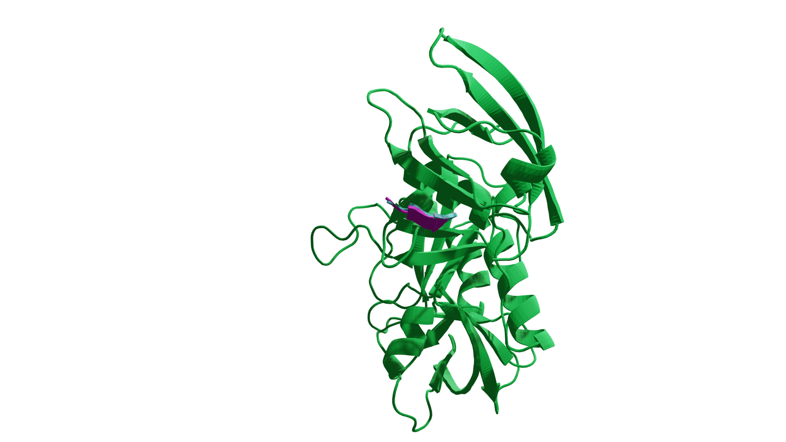
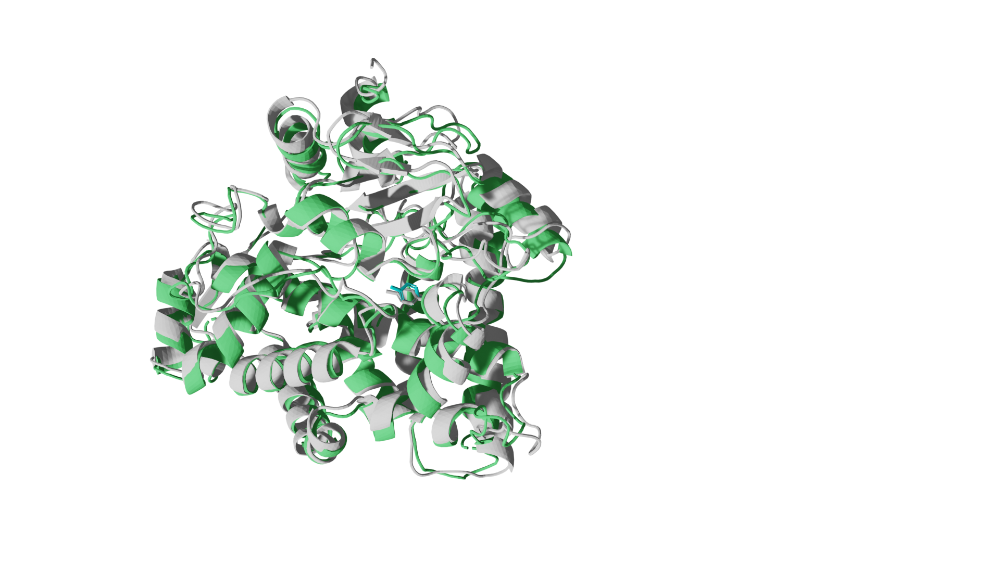

Our research tries to answer questions about the evolution of proteins and how this information can be used to create a new range of AI tools.
The tools we have developed make it possible to predict the structure of protein interactions, and to design new molecules that bind to proteins.
 
 
We aim to create a universal molecular framework, where any molecule can be predicted.
We are deploying the technology we develop and **test it in the lab** to create new molecular functions.
 
 

# Binder design

<a href="https://www.biorxiv.org/content/10.1101/2022.07.23.501214v1.full.pdf"> Bryant P, Elofsson A. EvoBind: in silico directed evolution of peptide binders with AlphaFold. bioRxiv. 2022. p. 2022.07.23.501214. doi:10.1101/2022.07.23.501214

<a href="https://www.nature.com/articles/s42004-023-01029-7"> Bryant P, Elofsson A. Peptide binder design with inverse folding and protein structure prediction. Communications Chemistry. 2023; 6: 229.

 

# Structure prediction of protein-ligand complexes

<a href="https://www.biorxiv.org/content/10.1101/2023.11.03.565471v1"> Structure prediction of protein-ligand complexes from sequence information with Umol. Preprint (2023)

 

# Structure prediction of alternative protein conformations

<a href="https://www.biorxiv.org/content/10.1101/2023.09.25.559256v1"> Bryant P., Noé F. Structure prediction of alternative protein conformations. Preprint (2023)

 

# Structure prediction of protein complexes

<a href="https://www.biorxiv.org/content/10.1101/2023.07.04.547638v1"> Bryant P., Noé F. Improved protein complex prediction with AlphaFold-multimer by denoising the MSA profile. Preprint (2023)

<a href="https://www.nature.com/articles/s41467-022-33729-4"> Bryant, P., Pozzati, G., Zhu, W. et al. Predicting the structure of large protein complexes using AlphaFold and Monte Carlo tree search. Nat Commun 13, 6028 (2022).

<a href="https://www.nature.com/articles/s41467-022-28865-w"> Bryant P, Pozzati G, Elofsson A. Improved prediction of protein-protein interactions using AlphaFold2. Nat Commun. 2022;13: 1–11.

<a href="https://www.nature.com/articles/s41594-022-00910-8 "> Burke, D.F., Bryant, P., Barrio-Hernandez, I. et al. Towards a structurally resolved human protein interaction network. Nat Struct Mol Biol (2023). https://doi.org/10.1038/s41594-022-00910-8

<a href="https://www.nature.com/articles/s41594-022-00849-w"> Akdel M, Pires DEV, Pardo EP, Jänes J, Zalevsky AO, Mészáros B, Bryant P et al. A structural biology community assessment of AlphaFold2 applications. Nat Struct Mol Biol 29, 1056–1067 (2022). https://doi.org/10.1038/s41594-022-00849-w

 
