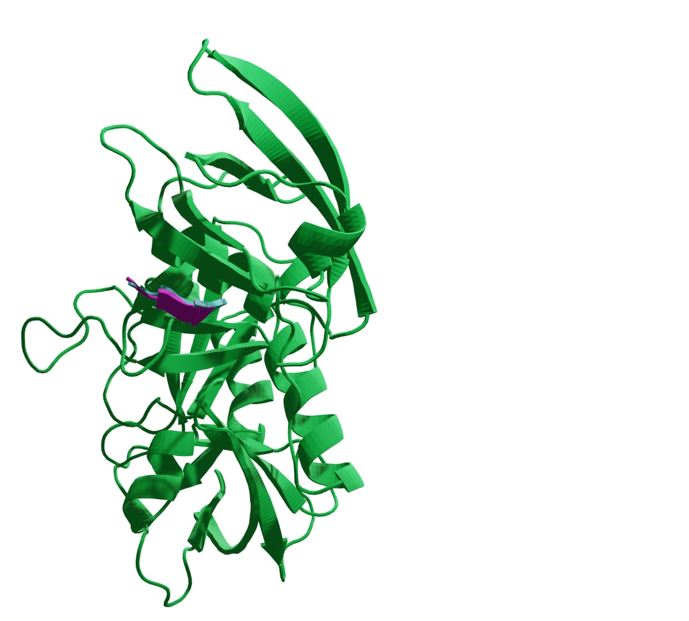

# Open source software

<a href="https://github.com/patrickbryant1/EvoBind"> EvoBind: peptide binder design.
 

 

<a href="https://github.com/patrickbryant1/Umol"> Umol

 

<a href="https://github.com/patrickbryant1/Cfold"> Cfold

 

<a href="https://github.com/patrickbryant1/SpeedPPI"> SpeedPPI - pairwise interactions

<a href="https://github.com/patrickbryant1/MoLPC"> MoLPC - large complex assembly

 
