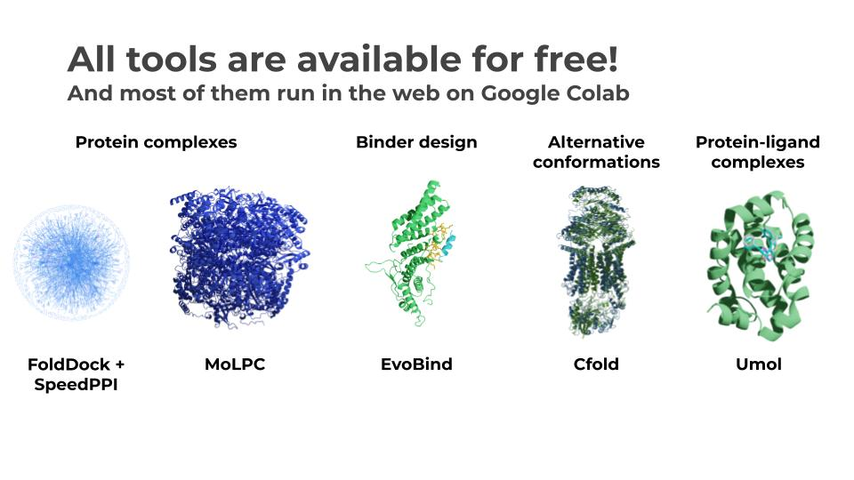

# Open source software

<a href="https://github.com/patrickbryant1/SpeedPPI"> SpeedPPI: pairwise interactions

<a href="https://github.com/patrickbryant1/MoLPC"> MoLPC: large complex assembly

<a href="https://github.com/patrickbryant1/EvoBind"> EvoBind: peptide binder design.

<a href="https://github.com/patrickbryant1/Cfold"> Cfold: structure prediction of alternative protein conformations

<a href="https://github.com/patrickbryant1/Umol"> Umol: structure prediction of protein-ligand complexes
