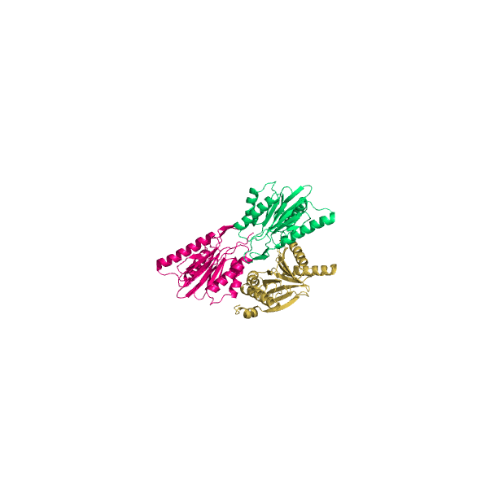

RareFold - noncanonical amino acids: <https://github.com/patrickbryant1/RareFold>

  
&nbsp; &nbsp; &nbsp; &nbsp;
  

EvoBind - peptide binder design: <https://github.com/patrickbryant1/EvoBind>

&nbsp; &nbsp; &nbsp; &nbsp;

Cfold - structure prediction of alternative protein conformations: <https://github.com/patrickbryant1/Cfold>

MoLPC - large protein complex assembly: <https://github.com/patrickbryant1/MoLPC>

Umol - structure prediction of protein-ligand complexes: <https://github.com/patrickbryant1/Umol>

Pairwise protein interactions: <https://github.com/patrickbryant1/SpeedPPI>
